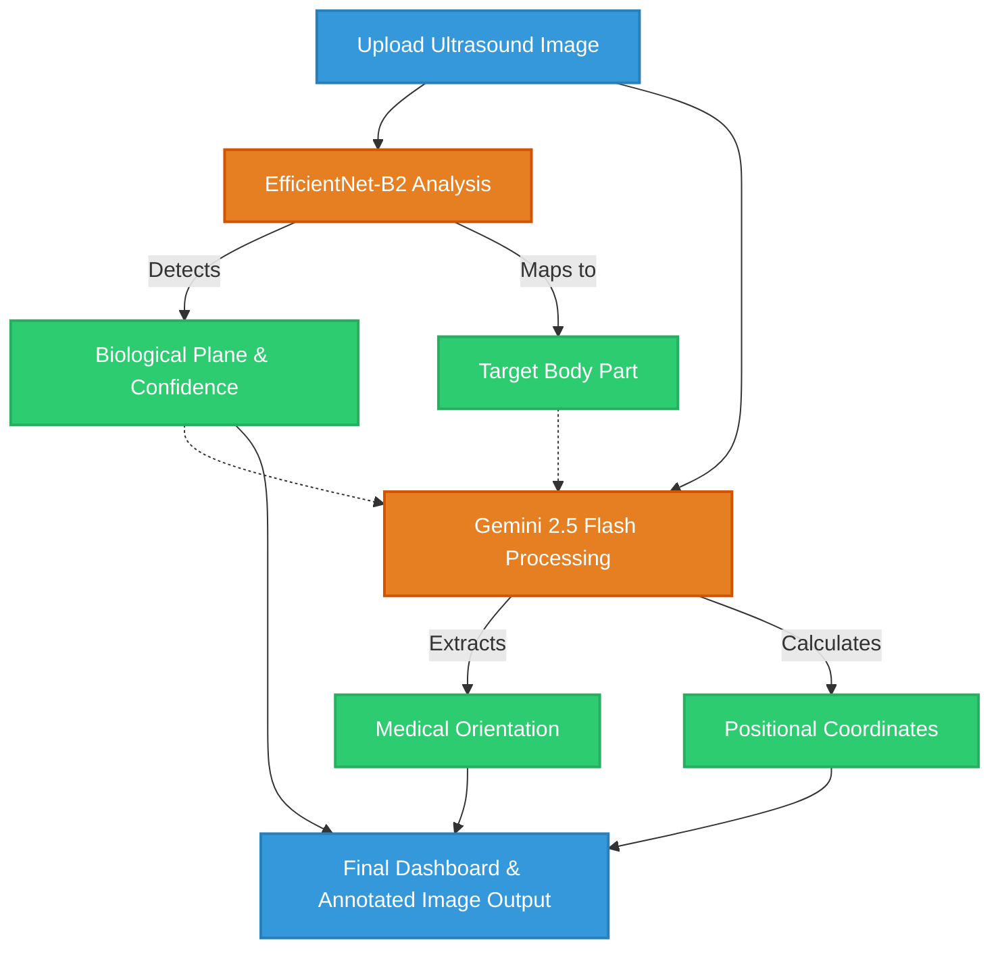

# 🩺 AI Fetal Ultrasound Analyzer

This is an advanced AI-powered web application for analyzing fetal ultrasound images. It combines a fine-tuned EfficientNet-B2 medical imaging model with the multimodal capabilities of Gemini 2.5 Flash to automatically identify biological planes, provide clinical context, and locate specific regions within the scan.

## 🌟 Key Features

- **Plane Classification:** Automatically identifies the ultrasound plane (e.g., AC, BPD, FL).
- **Medical Localization:** Calculates bounding box coordinates for target regions in the image.
- **Orientation Context:** Determines fetal orientation (e.g., Cephalic, Breech) based on the image plane.
- **Modern UI:** Built on Streamlit with a clean, responsive, and professional dashboard interface.

## ⚙️ Architecture & Workflow

Below is the high-level workflow of the system from user upload to final visual diagnosis.



## 🛠️ Project Structure

```text
d:\FETAL_02\
├── .env                              # Environment variables (GEMINI_API_KEY)
├── app.py                            # Main Streamlit UI and application logic
├── model_inference.py                # EfficientNet-B2 model loading and prediction logic
├── gemini_analysis.py                # LangChain wrapper for Gemini Multimodal API
├── efficientnet_b2_ultrasound.h5     # Trained EfficientNet-B2 Model Weights
├── best_efficientnet_ultrasound.h5   # Best checkpoint from training
├── model_try.ipynb                   # Model training & experimentation notebook
├── project_report.md                 # Detailed project report with metrics
├── requirements.txt                  # Python dependencies
└── README.md                         # Project documentation
```

## 🚀 Getting Started (Web app )

### Prerequisites

Ensure you have Python 3.9+ installed.

### 1. Install Dependencies

```bash
pip install -r requirements.txt
```

### 2. Environment Setup

Create a `.env` file in the root directory and add your Google Gemini API key:

```env
GEMINI_API_KEY=your_api_key_here
```

### 3. Run the Application

```bash
streamlit run app.py
```


### 📱 Mobile / Android Integration
    
# ⚠️ Important Note for Mobile Developers
    If you want to integrate this model into an Android or any mobile application, you cannot use the .h5 file directly.
    The .h5 format is a Keras/TensorFlow format designed for server-side or desktop use.
    Mobile apps require the TensorFlow Lite (.tflite) format.
    
### ✅ Use the Pre-converted TFLite Model
 This repository already includes the converted model:

```bash
    fetal_ultrasound.tflite
```

    This file was generated using the convert_intotflite.ipynb notebook. You can use it directly in your Android app without any additional conversion steps.
   


## ✨ Technologies Used

- **Frontend:** Streamlit
- **Deep Learning Model:** TensorFlow / Keras (EfficientNet-B2)
- **Generative AI:** LangChain, Google Gemini 2.5 Flash
- **Image Processing:** OpenCV, Pillow, Numpy
